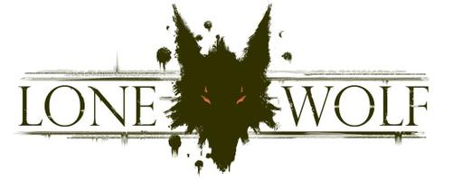

   

# Lone Wolf

## Table of contents
* [Introduction](#introduction)
* [A bit of history](#a-bit-of-history)
* [Contributing](./CONTRIBUTING.md)
* [MIT License](./LICENSE.md)

## Introduction

Lone Wolf is a proof-of-concept development based on the work of Joe Dever, edited by [Gallimard Jeunesse](http://www.gallimard-jeunesse.fr/Catalogue/GALLIMARD-JEUNESSE/Un-Livre-dont-vous-etes-le-Heros). For more information on the original work, please refer to the section "[A bit of history](#a-bit-of-history)".

## A bit of history

Lone Wolf is a series of 30 gamebooks, created by Joe Dever and initially illustrated (books 1-8) by Gary Chalk. The series was first published in July 1984 and sold more than 9 million copies worldwide.

The story focuses on the fictional world of Magnamund, where the forces of good and evil fight for control of the planet. The protagonist is Lone Wolf, last of his caste of warrior monks known as Kaï Lords. The book series is written in the second person and recounts Lone Wolf's adventures as if the reader is the main character. As Lone Wolf, the reader makes choices at regular intervals throughout the story which then change the course, and the final outcome, of the book.

[More informations (Wikipedia)](https://en.wikipedia.org/wiki/Lone_Wolf_(gamebooks))
